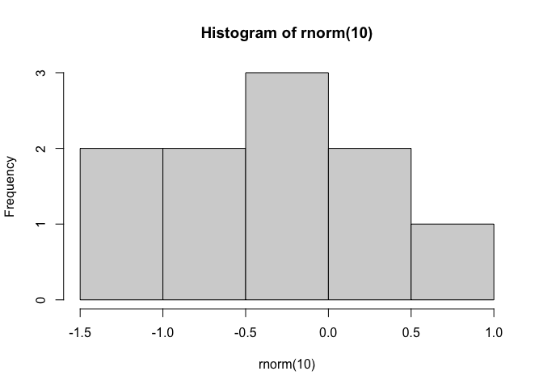

homework1
================
Karl Rohe
9/22/2022

## oh, hai

``` r
rnorm(10)
```

    ##  [1]  0.8801814 -1.0653350 -1.4705682 -0.8075240 -0.2585545 -1.9669270
    ##  [7] -1.0656444  0.2246151 -0.4265660  1.1245533

``` r
hist(rnorm(10))
```

<!-- -->
